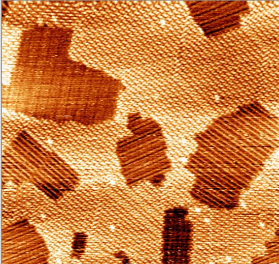

# Master's thesis: STM-feature-classificaton-ANN

(Submitted and defended Jan 2020)
Use of a fully convolutional network (FCN) to demonstrate the interest of CNN-based approaches to computer vision tasks that may arise in the context of STM/SPM (scanning tunneling/probe microscopies). We chose to implement a segmentation network for image segmentation. Here an FCN-8 is applied to small datasets (~10^1) of experimental STM images. While this demonstrates applicability of neural network-based computer vision to such data, larger datasets are needed to test generalizability.

STM and more broadly, SPM (scanning probe microscopy), are tools used to probe molecular properties on nanometer scales. A bias voltage is imposed between a probe tip and a conductive surface containing sample, and current is tunneled that reflects sample local density of electron states (LDOS). Typical ambient temperature STM image datasets often have high noise due to probe drift and typically only a few images per scan area are taken.

A high-quality STM image of two organic molecules self-assembling on graphite:

